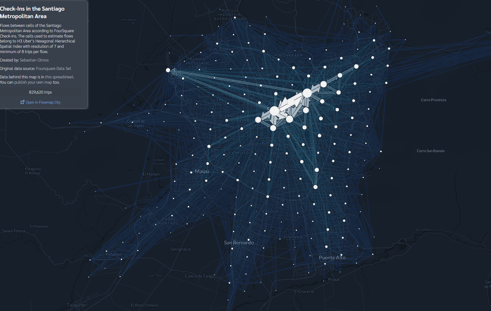
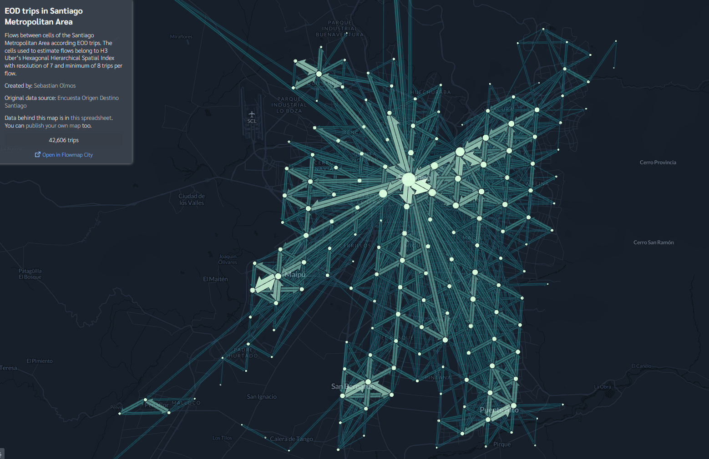

# Unitrip: Unified Trips format for multiple trips sources
Module for specifying the Unitrip format and tools for its processing and conversion.

### The first version of the unitrip format that is proposed is

| trip_id | user_id | o_lon | o_lat | d_lon | d_lat | o_h3_cell | d_h3_cell | o_time | d_time | Other properties... |
|:---:|:---:|:---:|:---:|:---:|:---:|:---:|:---:|:---:|:---:|:---:|
| 1 | 230 | -70.578518 | -33.402201 | -70.59798 | -33.517874 | 8cb2c556db34dff | 8cb2c50939a2dff | Fri Apr 20 14:49:25 2012 | Fri Aug 10 15:04:41 2012 | ... |
| 2 | 801 | -70.650669 | -33.441378 | -70.573737 | -33.405494 | 8cb2c55413335ff | 8cb2c556db489ff | Mon May 07 19:11:55 2012 | Mon May 13 12:10:38 2013 | ... |

### And the format for the flows (aggregating the trips using h3 cells) proposed is
| flow_id | o_h3_cell | d_h3_cell | count |
|:---:|:---:|:---:|:---:|
| 1 | 87b2c5080ffffff | 87b2c5081ffffff | 9 |
| 2 | 87b2c5082ffffff | 87b2c5090ffffff | 184 |

---
## Use Case: Visualization in flowmap.blue using h3 spatial index system for trip aggregation

Flows between cells of the Santiago Metropolitan Area according to FourSquare Check-ins. The H3 resolution is 7 and flows have a minimum of 8 trips. [Here you can see the visualization](https://www.flowmap.blue/1zVGC9qTSprneh_D6vDat_POg-_jfy28EAm4EMpiO4nE)

Flows between cells of the Santiago Metropolitan Area according EOD trips. . The H3 resolution is 7 and flows have a minimum of 8 trips. [Here you can see the visualization](https://www.flowmap.blue/1oTll7OJe8yTegiUeLZgQ-lZR6fTmrEIu5OF52C_1IKk)

TO DO: Adatrap trips data