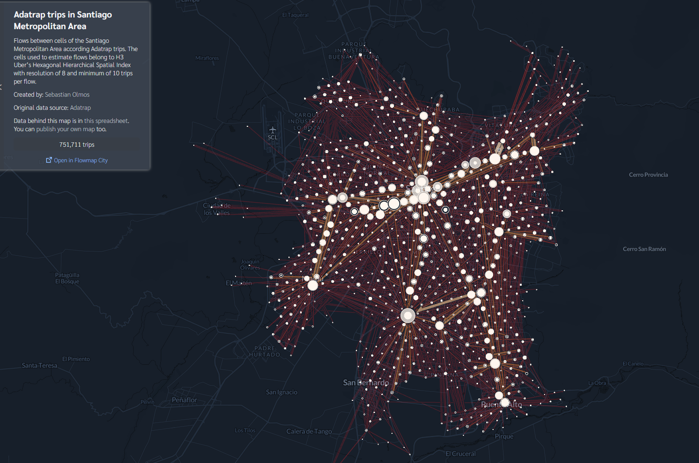

# Unitrip: Unified Trips format for multiple trips sources
Module for specifying the Unitrip format and tools for its processing and conversion.

### The first version of the unitrip format that is proposed is

| trip_id | user_id | o_lon | o_lat | d_lon | d_lat | o_h3_cell | d_h3_cell | o_time | d_time | Other properties... |
|:---:|:---:|:---:|:---:|:---:|:---:|:---:|:---:|:---:|:---:|:---:|
| 1 | 230 | -70.578518 | -33.402201 | -70.59798 | -33.517874 | 8cb2c556db34dff | 8cb2c50939a2dff | Fri Apr 20 14:49:25 2012 | Fri Aug 10 15:04:41 2012 | ... |
| 2 | 801 | -70.650669 | -33.441378 | -70.573737 | -33.405494 | 8cb2c55413335ff | 8cb2c556db489ff | Mon May 07 19:11:55 2012 | Mon May 13 12:10:38 2013 | ... |

### And the format for the flows (aggregating the trips using h3 cells) proposed is
| flow_id | o_h3_cell | d_h3_cell | count |
|:---:|:---:|:---:|:---:|
| 1 | 87b2c5080ffffff | 87b2c5081ffffff | 9 |
| 2 | 87b2c5082ffffff | 87b2c5090ffffff | 184 |

---
## Use Case: Visualization in flowmap.blue using h3 spatial index system for trip aggregation

All notebooks do a similar work, differing in how they load the data and the selection of columns. In short, they load the data from each dataset, then using the Unitrip module methods, convert the trip data (from adastrap, foursquare or eod format) to Unitrip format. Then it converts the trips into flows (Uniflow format) defining a lower h3 resolution for the aggregation of trips into flows. Finally the uniflow data is converted to the one that uses flowmap.blue as input.

The way to use the module can be seen in the noebooks:
- `notebooks/foursquare_to_flowmap.ipynb`: In the case of using Foursquare data.
- `notebooks/eod_to_flowmap.ipynb`: In the case of using EOD data.
- `notebooks/adatrap_to_flowmap.ipynb`: In the case of using public transportation trips infered with Adatrap.

The generated visualizations are displayed bellow:

Flows between cells of the Santiago Metropolitan Area according to FourSquare Check-ins. The H3 resolution is 7 and flows have a minimum of 8 trips. [Here you can see the visualization](https://www.flowmap.blue/1zVGC9qTSprneh_D6vDat_POg-_jfy28EAm4EMpiO4nE)

Flows between cells of the Santiago Metropolitan Area according EOD trips. The H3 resolution is 7 and flows have a minimum of 8 trips. [Here you can see the visualization](https://www.flowmap.blue/1oTll7OJe8yTegiUeLZgQ-lZR6fTmrEIu5OF52C_1IKk)

Flows between cells of the Santiago Metropolitan Area according public transportation trips infered with Adatrap. The H3 resolution is 8 and flows have a minimum of 10 trips. [Here you can see the visualization](https://www.flowmap.blue/1FYctUexmJY863rKdKh1EIXdcGeKrpJKMmLGbO8Mo9Ho)

-- 
## Module methods
(TODO)

---
## Datasets
(TODO)
